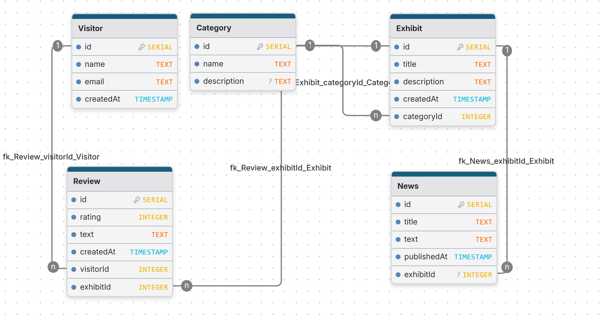

# Backend

Лабораторная работа 2: доменная модель музея технологий на PostgreSQL + Prisma.

## ER-диаграмма

## ЛР 4 — REST API

После `npm run start:dev` в каталоге `server`:

- OpenAPI (Swagger UI): `http://localhost:3000/api/docs` (порт из `PORT` в `.env`)
- Префикс ресурсов: `/api/...` (например `GET /api/exhibits?page=1&limit=10`)
